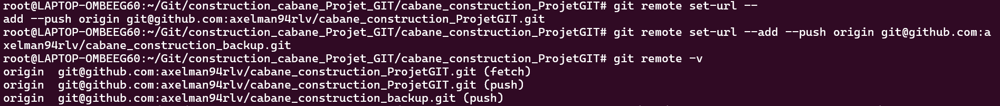
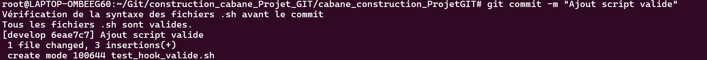
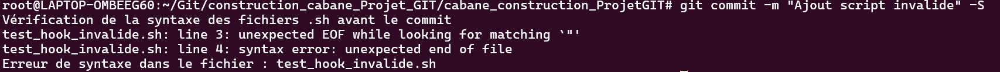

# Projet de Construction de Cabane

Ce projet a pour objectif de créer une application pour gérer les étapes de construction d'une cabane.

## Description

Le projet permet de suivre les différentes étapes de la construction d'une cabane, de la préparation du terrain à l'assemblage final.

## Fonctionnalités

- Suivi de la progression des étapes de la construction.  
- Possibilité d'ajouter des plans, de définir des dimensions et de préparer le terrain.  
- Gestion de fondations, piliers, murs, et toiture.  

## Installation

Clonez ce repository sur votre machine locale :

```bash
git clone https://github.com/axelman94rlv/cabane_construction_ProjetGIT.git
cd projet-cabane
```


## Configuration des remotes


Ce projet est configuré pour utiliser deux remotes sur Github :  
-Remote principale : [cabane-construction](https://github.com/axelman94rlv/cabane_construction_ProjetGIT)  
-Remote backup : [cabane-construction](https://github.com/axelman94rlv/cabane_construction_backup)  

  

Toute modification est automatiquement push sur les deux remotes avec `git push origin`.

## Configuration du hook

Un hook a été crée pour vérifier les fichiers .sh :




